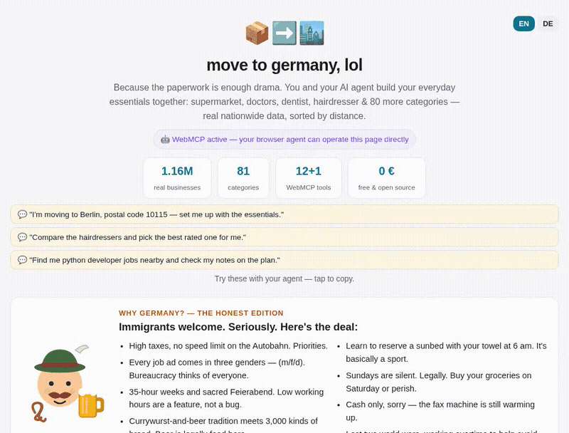

# move to germany, lol 📦➡️🏙️

**The collaborative arrival planner for you + your AI agent.** Because the
paperwork is enough drama.

**Live: [movetogermany.lol](https://movetogermany.lol)** · WebMCP Challenge entry

[](https://webmcp-tool.com/b/movetogermany.lol)




## What it does

Relocating to Germany means rebuilding your entire everyday infrastructure —
supermarket, doctor, dentist, hairdresser, bank, a job, and the bureaucracy
boss fight — in a place you don't know yet. Neither side solves this well
alone: a human needs thirty browser tabs; an agent alone makes decisions
about your life without you.

This page is a **shared workspace** for both:

- One sentence to your agent — *"Set me up at 10115"* — and
  `generate_starter_plan` searches the essential categories **in parallel**
  across 80+ live German directories and fills the shared plan.
- The human **vetoes, swaps and writes notes** right into the entries.
- The agent **reads the notes back** (`get_shortlist`) and acts on them.
- A live **activity feed** shows who did what (🤖 / 🧑).
- The whole co-authored plan **serializes into a share link** — send it to
  your partner and *their* agent continues where yours left off.
- `find_jobs` searches real openings via the **official Federal Employment
  Agency API**; `get_paperwork_checklist` hands over the official
  bureaucracy steps (Anmeldung → tax ID → … → broadcasting fee).
- Every plan entry carries **real actions**: call, website, route
  (Google Maps), online booking where the directory knows one, and a
  drafted first-contact message (`draft_outreach`) that folds the human's
  handwritten note into the text.
- A citable, human-grade **[arrival guide](https://movetogermany.lol/guide)**
  (week-by-week checklist, official links only) — also served as Markdown
  via content negotiation.
- **Discovery is solved structurally**: all 80+ directories of the network
  link here from their footers and llms.txt files, so both crawlers and
  agents reading any network domain find the planner.

## WebMCP implementation

**13 imperative tools** via `document.modelContext.registerTool` — typed
JSON schemas, per-property descriptions, explicit `required` lists,
`readOnlyHint` on read paths, `untrustedContentHint` where tools return
human-written notes:

| Tool | Notes |
|---|---|
| `list_categories` | read-only; German + English labels for slug mapping |
| `set_home_plz` | page state |
| `find_nearby` | one category, renders live |
| `generate_starter_plan` | 15 categories in parallel → closest per category into the plan |
| `add_to_shortlist` / `remove_from_shortlist` | co-curation |
| `get_shortlist` | read-only + `untrustedContentHint` (returns human notes) |
| `set_note` | annotate entries |
| `draft_outreach` | ready-to-send first-contact message per entry, uses the human's note |
| `find_jobs` | official Bundesagentur für Arbeit data |
| `get_paperwork_checklist` | official links only |
| `export_plan` | **conditional** — registered only while the plan has entries |
| `compare_candidates` | **conditional** — registered only while a category has 2+ results |

The two conditional tools register/unregister with page state via
`AbortController`, so the agent's tool list always mirrors what is actually
possible — the lifecycle the spec intends. The postal-code form additionally
carries the **declarative API** annotations (`toolname`, `tooldescription`,
`toolautosubmit`, `toolparamdescription`).

Tools and click handlers call the **same functions**: the page is one state
machine with two front doors (mouse and model).

## Data layer

The ["in meiner Nähe" network](https://friseur-in-meiner-naehe.de/llms.txt):
**80+ live, agent-readable German business directories** we operate —
**1.16M real businesses** from OpenStreetMap + Overture Maps, distance-sorted
per postal code, each directory with its own JSON API, MCP endpoint and
llms.txt (independently scored 97/100 on webmcp-tool.com's Agent Readiness
Check). `network.json` is the catalog snapshot; `server.py` (stdlib Python,
**zero dependencies**) aggregates them in parallel and falls back to the
public APIs automatically — so this repo runs anywhere.

The app itself is agent-readable too: markdown content negotiation, JSON-LD,
llms.txt, OpenAPI, `/.well-known/mcp.json`, an AI-crawler-welcoming
robots.txt.

## Run it

```bash
python3 server.py           # http://127.0.0.1:8871 — uses the public network APIs
```

No dependencies, no build. Test WebMCP in ChatGPT's in-app browser, or in
Chrome via `chrome://flags/#enable-webmcp-testing`.

## License

MIT. Data: OpenStreetMap (ODbL 1.0, © OpenStreetMap contributors) & Overture
Maps Foundation (CDLA-Permissive-2.0). Job data: Bundesagentur für Arbeit
(official public API).
